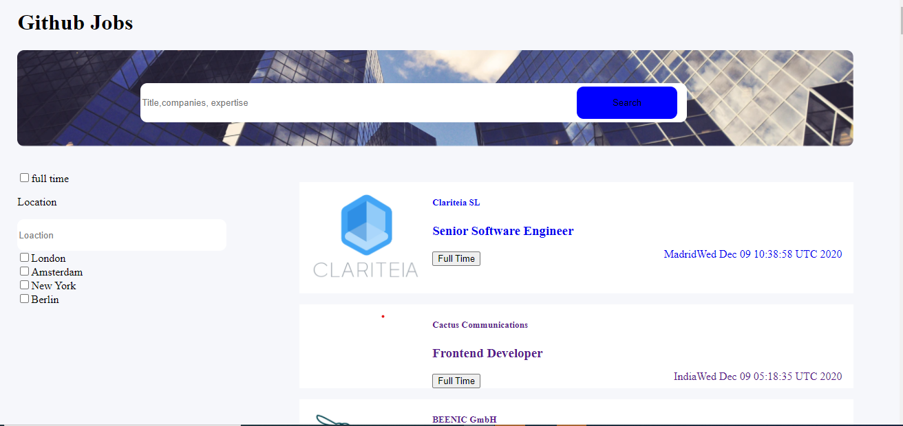
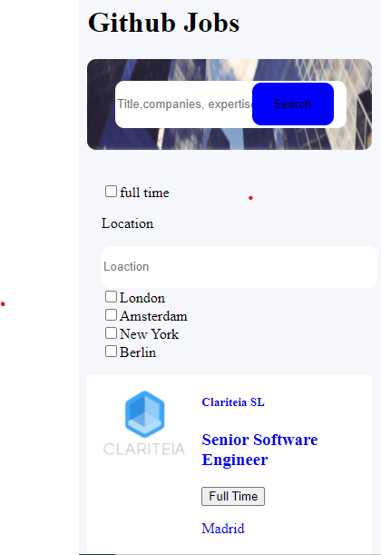

# Github Jobs

Here we are, the last graded project of this semester.

Your challenge: Create a job search using an API, and use React to handle the frontend. Don’t look at the existing solution. Fulfill user stories below:


- User story: I can see a list of jobs in a city by default
- User story: I can search for jobs with a given keyword
- User story: I can search for jobs with a city name, zip code or other location
- User story: I can select one option from at least 4 pre-defined options
- User story: I can search for a full-time job only
- User story: I can see a list of jobs with their logo, company name, location, and posted time.
- User story: When I select a job, I can see job descriptions and how to apply like the given design.
- User story: When I am on the job details page, I can go back to the search page
- User story (optional): I can see a list of jobs in the closest city from my location by default
- User story (optional): I can see jobs in different pages, 5 items each page

You’ll also have to apply a few concept we learned in class, such as a **reducer** and a global **context**. And there will be a bonus for those who can find a use case for a **compound component**.

**Icon**: https://google.github.io/material-design-icons/ (you can also use the react-icons package)

**API**: https://jobs.github.com/api. Use data from the API to create questions and answers.

*If you get some CORS errors, you can use https://cors-anywhere.herokuapp.com/ to help with accessing data from other websites that are normally forbidden by the same-origin policy of web browsers*

**Design** : https://www.figma.com/file/gAkVx9CdOqnJcCjJ7nVNkw

**Live app** : https://jolly-heisenberg-20c49e.netlify.app/

Once you completed, polish a nice readme submit your solutions on this link : https://forms.gle/Xg6kJMKmrBkyTe3TA, by providing URLs for both GitHub repository and live app on Netlify.

For the custom domain url you'll enter in netlify, please use the following naming convention : **github-jobs-_YOUR_FIRSTNAME_.netlify.app** (replace YOUR_FIRSTNAME by your firstname)

Good luck everybody!

Template for your readme :

<!-- Please update value in the {}  -->

<h1 align="center">Github Jobs</h1>

<div align="center">
  <h3>
    <a href="https://objective-cori-42d782.netlify.app/">
      Demo
    </a>
    <span> | </span>
    <a href="https://github.com/bakozetra/github-jobs">
      Solution
    </a>
  </h3>
</div>

<!-- TABLE OF CONTENTS -->

## Table of Contents

-   [Overview](#overview)
    -   [Built With](#built-with)
-   [Features](#features)
-   [How to use](#how-to-use)
-   [Contact](#contact)
-   [Acknowledgements](#acknowledgements)

<!-- OVERVIEW -->

## Overview
 


This app looks like this in mobile 


Introduce your projects by taking a screenshot or a gif. Try to tell visitors a story about your project by answering:

-   Where can I see your demo?
You can see my projet in this link <a href="https://objective-cori-42d782.netlify.app/"/>
-   What was your experience?
I have learn hoe to use filter , which is quite hard but I still can solve some of them. I have learn how to use useReducer which makes my code ease to undersatand and clean.

-   In a few sentences, explain the structure of your project.
  First and foremost , I use React , useReducer, useContext and Router. I have two folder Component folder and pages folder. I put the App file and index file outside of those folders. I created GlobalContext which contains all of the conditions of my code such as filtering. I use useReducer to get my Api. After that , I created a MainJob file to put my useContext. I used MainJob to wrap the listOfJobComponent file so that I can use the value of the main Job later. I put all the component in ListOfJob file 
   I created two folder: 
       - Component folder :
       This folder contains 4 files which are about html.
       - pages folder : 
       This folder contains 6 files which is about the general rules. 
       I put the GlobalContext.js which is about all the reducer code


-   If you had more time, what area of your project would you improve?
 If I have more time , I would like to make all checkboxes  and details  of the job get working.
 
-   Did you learn anything new while working on this project?
I have learned new concepts about filtering. I spend my time adding the lowercase in the reducer when I filter the API because I could not get the lowercase. However , at last I solved it.

-   What was the most challenging part for you?
There are many challenges in this project but the most challenging are  the checkbox and how to get the details of the job. They are the most challenged because I could not solve them even until now. But even that , I hope I still can solve them later on.


### Built With

 I used React : 
 - useState ,
 - useReducer , 
 - Router
<!-- This section should list any major frameworks that you built your project using. Here are a few examples.-->

-   [React](https://reactjs.org/)

## Features


This app looks like this in mobile 


## How To Use

<!-- Example: -->

To clone and run this application, you'll need [Git](https://git-scm.com) and [Node.js](https://nodejs.org/en/download/) (which comes with [npm](http://npmjs.com)) installed on your computer. From your command line:

```bash
# Clone this repository
$ git clone https://github.com/your-user-name/your-project-name

# Install dependencies
$ npm install

# Run the app
$ npm start
```

## Acknowledgements

<!-- This section should list any articles or add-ons/plugins that helps you to complete the project. This is optional but it will help you in the future. For example: -->

## Contact

-   Website [your-website.com](https://{your-web-site-link})
-   GitHub [@your-username](https://{github.com/your-usermame})
